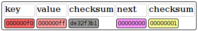
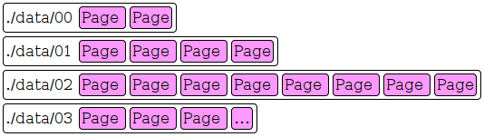

# Writing an append-only, on-disk key-value store with lockless reads in Rust.

Our goal for this blog post is to describe a key-value store with certain properties:

* Persistant on-disk storage of key-value pairs.
* Thread safety, should be `Send` + `Sync`.
* Lockless reads across threads.
* No single bottleneck lock while writing.

# Immutability

In order to implement all of this in about 400 lines, we give up on any mutability of already written keys. That is, when a key-value pair is written once, it will thereafter never change.

We also have to make sure `K` and `V` are `Copy`, i.e Plain Old Data.

# Datastructure

The datastructure of choice in this implementation is a hash-array mapped trie (or HAMT for short). It can be thought of as a nested hash-table.

The nodes of the trie consists of a series of Entries.


The node sizes are defined as the amount of Entries that fit into a 4Kib page. (a common cache-page size)

We will take a closer look at `Entry` here.



The first two fields should be self-explanatory, but what about `next` and the checksums?

It turns out, since we are using memory-mapped files, the initial state of any region of a page will be all zeroes. If we did not have the checksums, an entry with `key` and `val` set to zero would be indistinguisable from a vacant entry in the node.

The checksums also work as such, checksums, making sure any botched half-writes to the underlying medium will also be considered vacant.

# Insertion method

In order to quickly insert into the table without lock-contestation the initial search is carried out completely without locking by the following procedure.

The root-node on page 0 is consulted, the key is hashed and it's slot is calculated. Here we have three possible outcomes for the corresponding entry:

**1: The entry is invalid**

* Just write a new `Entry` in place and end.

**2: The `next` attribute is nonzero**

* Recurse into the new page pointed to.

**3: The `next` attribute is zero**

* Create a new page, and modify the `next` value in the `Entry`

# Locking

When do we need to take locks on writing?

## Adding a new page

In a relatively small number of cases, a new page has to be created. For this a lock must be taken, to update the page counter, and in certain cases creating new memory mapped files. The majority of writes doesn't touch this path.

## Modifing an entry

When an entry is modified, either by assigning it a key-value pair or by updating it's next pointer, a corresponding lock must be taken.

But which lock? Having one single lock for writes would be a bottleneck, but keeping individual locks for each page is unwieldly.

To solve this problem we use a static array of mutexes like this:

```rust
static SHARDS: [Mutex<()>; 1024] = Default::default()
```

(if only we had const generics that is)

We then calculate a value from the page and slot offset of the entry, take that modulo 1024, and lock that mutex.

This way, we have only a very small chance of two writes happening simultaneously in buckets with identical shard-index, and the bottleneck is avoided while still maintaining safety.

# On-disk storage

For the on-disk storage we're using memory mapped files. Let's have a look at their layout.



If the first memory map fits 32 pages, the second fits 64, and so on. This is so that we can have a finite amount of Mmaps and still not run out of space anytime soon.

# Stress testing

For stress testing, one of the tests spawns 8 writer and 8 reader threads and simultaneously writes and reads values in random order. I might consider more advanced test methods, but for now it's a proof of concept.

# Lastly

Check out the [docs](https://docs.rs/appendix/)

Check out the code in [this repository](https://github.com/krl/appendix/) for the concrete implementation.

For comments: [Reddit post](https://www.reddit.com/r/rust/comments/aiyzco/writing_an_appendonly_ondisk_keyvalue_store_with/)

# Author

Kristoffer Ström *<kristoffer@rymdkoloni.se>*

*PS. I am currently looking for employment in the Berlin area or freelance work.*


